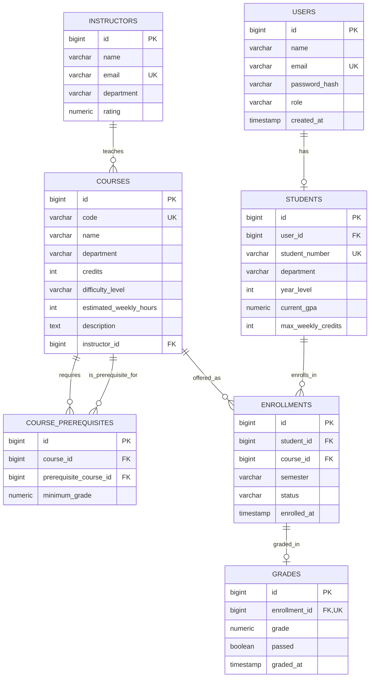

# Smart University Advisor AI (C++)

Drogon and PostgreSQL backend for the Smart University Advisor project, with
a Gemini-powered agentic advisor endpoint on top of the REST API.

## Run

```sh
docker compose up
```

The API listens on `http://localhost:8080`:

```sh
curl http://localhost:8080/courses
```

PostgreSQL is available to local tools at `localhost:5433`; the API uses the
internal Docker network and connects to `db:5432`.

Optional database settings can be overridden with `DB_NAME`, `DB_USER`, and
`DB_PASSWORD`. Their defaults are `smart_university_advisor`, `advisor`, and
`advisor_password`. The agent endpoint additionally requires `GEMINI_API_KEY`
(and optionally `GEMINI_MODEL`, default `gemini-3.1-flash-lite`).

## Schema

7 tables, derived from [`database/schema.sql`](database/schema.sql):



Key constraints: `students.year_level` 1–6, `students.current_gpa` 0–100,
`courses.difficulty_level` in (`easy`, `medium`, `hard`),
`enrollments.status` in (`planned`, `active`, `completed`, `dropped`), a
`UNIQUE (student_id, course_id, semester)` on `enrollments`, and a
`UNIQUE (enrollment_id)` on `grades` (one grade per enrollment).

## Endpoints

| Method | Path | Purpose |
| --- | --- | --- |
| GET | `/courses` | Search the course catalog, filtered by department/difficulty/credits/instructor |
| GET | `/courses/{id}/details` | Full details for a single course (description, credits, difficulty, prerequisites) |
| GET | `/students/{id}/profile` | A student's profile (name, email, department, year, GPA, max weekly credits) |
| GET | `/students/{id}/academic-summary` | GPA plus completed/active/failed course counts and completed credits |
| GET | `/students/{id}/available-courses` | Courses a student is eligible for (not taken, prerequisites satisfied) |
| POST | `/students/{id}/course-recommendations` | Scored course recommendations from the available courses |
| POST | `/students/{id}/semester-plan` | Greedily build a semester plan within a credit limit |
| POST | `/students/{id}/risk-analysis` | Academic risk (Low/Medium/High) of taking a set of courses together |
| POST | `/enrollments` | Create an enrollment (student + course + semester) |
| PATCH | `/enrollments/{id}/grade` | Record or update a grade for an enrollment; marks it completed |
| DELETE | `/enrollments/{id}` | Delete an enrollment |
| POST | `/agent/query` | Ask the Gemini-powered advisor a natural-language question for a student |

## Agent tools

`POST /agent/query` runs an agentic loop against Gemini with 8 function
tools (declared in
[`services/ToolRegistry.cc`](services/ToolRegistry.cc)), each backed by the
same service layer as the REST endpoints above:

1. `get_student_profile` — a student's profile
2. `get_academic_summary` — GPA and course-count summary
3. `get_available_courses` — courses the student is eligible to take
4. `get_course_recommendations` — scored course recommendations
5. `build_semester_plan` — greedy semester plan within a credit limit
6. `analyze_academic_risk` — risk analysis for a set of courses
7. `get_course_details` — full details for a course
8. `search_courses` — filtered course catalog search
