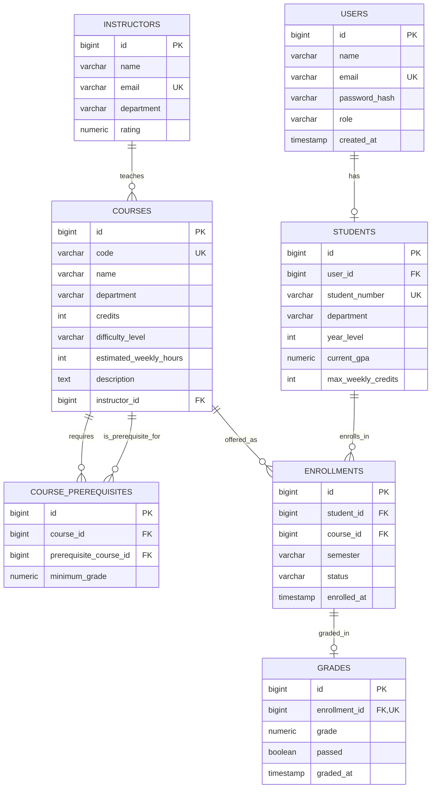

# Smart University Advisor
**C++ · Drogon · PostgreSQL · React · TypeScript · Docker**

A full-stack academic planning application. Students browse courses, check prerequisite eligibility, manage a semester plan, and ask an AI advisor for recommendations grounded in their academic records.

## Project at a glance
- **Backend:** REST endpoints, JWT authentication, role-aware authorization, and academic business rules.
- **Database:** seven related PostgreSQL tables for users, students, courses, prerequisites, enrollments, instructors, and grades.
- **Frontend:** course catalog, student profile, semester planning, and advisor chat.
- **AI integration:** a bounded Gemini tool loop with eight read/analysis tools. Students confirm enrollment changes through the UI.
- **Engineering documentation:** [agent transcripts](docs/agent-demo.md), [authentication checks](docs/auth-tests.md), and [concurrency behavior](docs/concurrency-test.md).

## Quick start
Install Docker with Compose, then:

```bash
git clone https://github.com/nursala/smart_university_advisor.git
cd smart_university_advisor
cp .env.example .env
docker compose up --build
```

Configure `JWT_SECRET` in `.env`; add `GEMINI_API_KEY` to use the AI advisor. Keep local secrets out of Git.

| Service | Local address |
| --- | --- |
| Web application | http://localhost:5173 |
| REST API | http://localhost:8080 |
| PostgreSQL host port | localhost:5433 |

For local testing, create a student account through the registration page.

## Explore the implementation
| Area | Source |
| --- | --- |
| Routes and request handling | [controllers](controllers/) |
| Business rules and agent loop | [services](services/) |
| Authentication filter | [filters](filters/) |
| Schema and sample records | [database](database/) |
| User interface | [frontend](frontend/) |
| Tests and integration scripts | [test](test/) |

## Technical reference
The sections below document the API, data model, authorization rules, and current limitations.

### Backend connection details

```sh
docker compose up
```

The API listens on `http://localhost:8080`:

```sh
curl http://localhost:8080/courses
```

PostgreSQL is normally reachable from host tools at `localhost:5433` with the
configured local database credentials; the API itself always uses the
internal Docker network and connects to `db:5432`. Host-side access through the
forwarded port depends on the local Docker networking setup -- some Docker
Desktop/WSL2 configurations have been observed to reject those same credentials
over the forwarded port even though they work container-internally. If
`psql -h localhost -p 5433 -U advisor -d smart_university_advisor` fails on your
machine, connect via `docker compose exec db psql -U advisor -d
smart_university_advisor` instead.

Optional database settings can be overridden with `DB_NAME`, `DB_USER`, and
`DB_PASSWORD`. Set these values in your local environment using `.env.example`. The agent endpoint additionally requires `GEMINI_API_KEY`
(and optionally `GEMINI_MODEL`, default `gemini-3.1-flash-lite`). Auth
endpoints sign/verify session JWTs with `JWT_SECRET` (falls back to an
insecure dev-only default if unset -- always set a real value outside local
development; see `.env.example`).

## Schema

7 tables and 7 foreign-key constraints, derived from
[`database/schema.sql`](database/schema.sql):



Key constraints: `students.year_level` 1–6, `students.current_gpa` 0–100,
`courses.difficulty_level` in (`easy`, `medium`, `hard`),
`enrollments.status` in (`planned`, `active`, `completed`, `dropped`), a
`UNIQUE (student_id, course_id, semester)` on `enrollments`, and a
`UNIQUE (enrollment_id)` on `grades` (one grade per enrollment).

## Architecture decisions

The course's layering material teaches a four-layer flow: Route → Service →
Repository → (optional) Query. This project simplifies that to
`Controller -> Service -> PostgreSQL`: each service (`StudentService`,
`CourseService`, `EnrollmentService`, `UserService`) issues its own parameterized
SQL and transactions directly against `drogon::orm::DbClientPtr` -- including
multi-statement CTEs in `EnrollmentService` -- with no separate
`repositories/`/`query/` layer. At this project's size (four services, seven
tables) a Repository layer would only add a pass-through indirection without
decoupling anything real, so the Service layer absorbs that responsibility
directly. One component sits outside that chain: `filters/JwtAuthFilter.cc`
queries `students` directly to resolve the authenticated student id, because a
Drogon filter runs *before* the request reaches a controller and so structurally
cannot go through `Controller -> Service`. Filters are a cross-cutting layer
rather than part of the main request chain, which is the usual exception in
layered designs.

The course's model-generation material teaches an alternative to hand-written
SQL: `drogon_ctl create model models --config=config.json` to generate ORM model
classes per table. `models/model.json` here is only the generator config
scaffold -- no generated `.h`/`.cc` model classes exist or compile anywhere;
every query is hand-written parameterized SQL. This was a deliberate tradeoff:
hand-written SQL is easier to read and debug line-for-line (particularly the
CTE-based rules in `EnrollmentService`) than generated model code would be, at
the cost of manually keeping queries in sync with schema changes instead of
regenerating them.

One known gap, identified during review rather than chosen up front: the course's
project-organization material recommends a top-level namespace, partly because a
namespace is a natural candidate for later extraction into a separate library.
Every class here is in the global namespace (aside from an incidental
`ValidationHelpers`), and this was left as-is because wrapping every file is a
large, low-value change for a single executable that is not being split into
reusable libraries.

Concurrency correctness in this project is enforced primarily at the database
transaction level, not with in-process `std::mutex`/`std::atomic` guarding shared
mutable state: `EnrollmentService` runs its mutating operations under
`SET TRANSACTION ISOLATION LEVEL SERIALIZABLE` with `SELECT ... FOR UPDATE` row
locks, and this is race-tested directly in
[`docs/concurrency-test.md`](docs/concurrency-test.md) (25 concurrent enrollment
attempts against the same open slot: exactly one wins). This was a deliberate
choice, not an oversight: Drogon is a single-process async-event-loop server, so
the actual concurrency risk in this domain is concurrent *requests* racing against
the *database*, not shared in-process state, since each request's handler runs
to its next `await`-equivalent point without another handler interleaving inside
it on the same object. The one place genuine in-process concurrency exists is the
agent tool-execution path: `AgentLoop::executeFunctionCalls`
([`services/AgentLoop.cc`](services/AgentLoop.cc)) dispatches every tool call
within a round concurrently rather than one at a time, since Gemini can request
several independent tools in a single round with no data dependency between
them. Because those callbacks can legitimately land on different Drogon IO
threads at once, that path does use real C++ concurrency primitives: each
callback writes into its own reserved slot in a shared results buffer (so no two
threads ever write the same memory), and a `std::atomic<Json::ArrayIndex>`
counter -- plus `AgentLoop`'s `std::atomic<bool> finished_` -- safely picks
exactly one callback, whichever completes last, to resume the loop.

## Endpoints

The application exposes 17 meaningful Drogon routes:

| Method | Path | Purpose |
| --- | --- | --- |
| POST | `/auth/register` | Atomically create a student account and linked record; returns `{ token, user }` |
| POST | `/auth/login` | Verify email/password; returns `{ token, user }` |
| GET | `/users/me` | The authenticated user's profile (requires `Authorization: Bearer <token>`) |
| PATCH | `/users/me` | Update the authenticated user's name and/or email |
| GET | `/courses` | Search the course catalog, filtered by department/difficulty/credits/instructor |
| GET | `/courses/{id}/details` | Full details for a single course (description, credits, difficulty, prerequisites) |
| GET | `/students/{id}/profile` | A student's profile (name, email, department, year, GPA, max weekly credits) |
| GET | `/students/{id}/academic-summary` | GPA plus completed/active/failed course counts and completed credits |
| GET | `/students/{id}/available-courses` | Courses a student is eligible for (not taken, prerequisites satisfied) |
| POST | `/students/{id}/course-recommendations` | Scored course recommendations from the available courses |
| POST | `/students/{id}/semester-plan` | Greedily build a semester plan within a credit limit |
| POST | `/students/{id}/risk-analysis` | Academic risk (Low/Medium/High) of taking a set of courses together |
| POST | `/enrollments` | Create an enrollment (student + course + semester) |
| GET | `/enrollments/planned` | List the authenticated student's planned enrollments |
| PATCH | `/enrollments/{id}/grade` | Record or update a grade for an enrollment; marks it completed |
| DELETE | `/enrollments/{id}` | Delete an enrollment |
| POST | `/agent/query` | Ask the Gemini-powered advisor a natural-language question for a student |

## Auth

The React application provides Profile, Courses, AI Advisor, and My Plan
pages. Student login and registration open Profile; staff login opens the
public course catalog. `/dashboard` remains only as a compatibility redirect
to the role-appropriate landing page. Profile editing is limited to the name
and email fields supported by `/users/me`; academic history, GPA, and grades
are not editable by students.

Displayed chat messages survive React route navigation but are intentionally
cleared by a full page refresh or logout. They remain only in React memory,
and Gemini receives only the latest submitted message.

Passwords are hashed with PBKDF2-HMAC-SHA256 (`services/PasswordHasher.cc`),
not bcrypt -- chosen to avoid a new system dependency, since OpenSSL is
already required for Drogon's TLS support. Sessions are HS256 JWTs
(`services/JwtService.cc`), verified by `filters/JwtAuthFilter`. All student,
enrollment, and agent routes require a JWT; course catalog routes remain
public intentionally.

Frontend authentication candidates are stored in `sessionStorage`, validated
through `/users/me` before protected UI is rendered, and cleared on logout or
authorization failure. Each backend process creates a random signed
`server_boot_id`; restarting the single API process invalidates every token
issued by its predecessor without changing `JWT_SECRET`. Multiple API replicas
would require a shared generation identifier rather than this process-local
scheme.

Registration atomically creates a `users` row and its linked `students` row,
then returns `{ "token": "...", "user": { ... } }`. New students start in
department `Undeclared`, year 1, with a 20-credit limit and a NULL GPA
(meaning no official grades yet).

Local demo accounts are defined in the database seed file. Create your own account to explore the student workflow.

Students can read/analyze only their linked record, create and delete only
their own planned enrollments, and cannot record grades. Advisors and
administrators may work across students, manage enrollments, and record
official grades. Agent tool arguments are server-scoped, so Gemini cannot
replace the authorized student identity.

## Academic and enrollment rules

The canonical semester format is `YYYY-Spring`, `YYYY-Summer`, `YYYY-Fall`,
or `YYYY-Winter`. New enrollments are always created as `planned`.

The application passing grade is **60**. A prerequisite is satisfied only by
a completed enrollment with a passing grade that also meets that
prerequisite's configured minimum. Planned, active, and failed attempts do
not satisfy prerequisites.

A passed course cannot be retaken. Planned or active courses cannot be added
again in another semester. A failed completed course may be retaken in a
later semester, while duplicate same-semester attempts remain prohibited.
Enrollment creation totals planned and active course credits for the target
semester and rejects additions above `students.max_weekly_credits`.

`current_gpa` is the arithmetic mean of all grades attached to completed
enrollments, including failed grades, rounded by the database column to two
decimal places. It is SQL `NULL` when there are no completed graded
enrollments; a real grade/GPA of zero remains numeric zero. Grade corrections
and graded-enrollment deletion update GPA atomically with the mutation.

Students add and remove planned courses manually from My Plan. The frontend
sends only `course_id` and a canonical `semester`; the JWT supplies the
student identity, and `EnrollmentService` enforces all academic rules.

Course enrollment is intentionally user-controlled because it changes academic
records. The AI recommends and previews plans, while the student performs the
final addition through My Plan.

## Agent tools

`POST /agent/query` runs a read-only agentic loop against Gemini with 8 function
tools (declared in
[`services/Tools.cc`](services/Tools.cc)), each backed by the
same service layer as the REST endpoints above:

1. `get_student_profile` — a student's profile
2. `get_academic_summary` — GPA and course-count summary
3. `get_available_courses` — courses the student is eligible to take
4. `get_course_recommendations` — scored course recommendations
5. `build_semester_plan` — greedy semester plan within a credit limit
6. `analyze_academic_risk` — risk analysis for a set of courses
7. `get_course_details` — full details for a course
8. `search_courses` — filtered course catalog search

Sanitized live Gemini and deterministic mocked regression transcripts are in
[`docs/agent-demo.md`](docs/agent-demo.md). Each transcript is explicitly
labeled so mocked output cannot be mistaken for live evidence.

## Implementation evidence

| Requirement | Evidence |
| --- | --- |
| 10+ Drogon endpoints | 17 routes in controller headers and the endpoint table above |
| PostgreSQL with 5+ related tables | 7 tables and 7 FKs in [`database/schema.sql`](database/schema.sql) |
| ERD/schema documentation | Mermaid ERD above |
| 8+ function tools | 8 read/analysis declarations in [`services/Tools.cc`](services/Tools.cc) |
| Gemini free API integration | Live `gemini-3.1-flash-lite` evidence in [`docs/agent-demo.md`](docs/agent-demo.md) |
| Real agentic loop | Six-step-capped loop in [`services/AgentLoop.h`](services/AgentLoop.h) |
| Demonstrated 3+ tool chain | Four-tool sanitized live transcript in [`docs/agent-demo.md`](docs/agent-demo.md) |
| Agent database operation | Intentionally not implemented: AI is read-only; authenticated students mutate planned records manually through My Plan |
| User management | Register/login/profile routes and PBKDF2/JWT services |
| Docker Compose | [`docker-compose.yml`](docker-compose.yml) |
| React TypeScript UI | [`frontend/src/App.tsx`](frontend/src/App.tsx) |
| Layer organization | `Controller -> Service -> PostgreSQL` (services call `drogon::orm::DbClientPtr` directly; there is no separate Repository layer) across controllers, filters, services, database, frontend, and tests directories |

## Known limitations

- Chat history survives client-side navigation but not a full page refresh.
- Browser-tab authentication uses `sessionStorage`; closing the tab ends the
  browser session after the browser discards that storage.
- There is no staff administration portal; staff navigation is intentionally
  limited.
- SSE and persistent conversational memory are not implemented.
- Live Gemini requires a locally configured API key; secrets are never stored
  in the repository.
